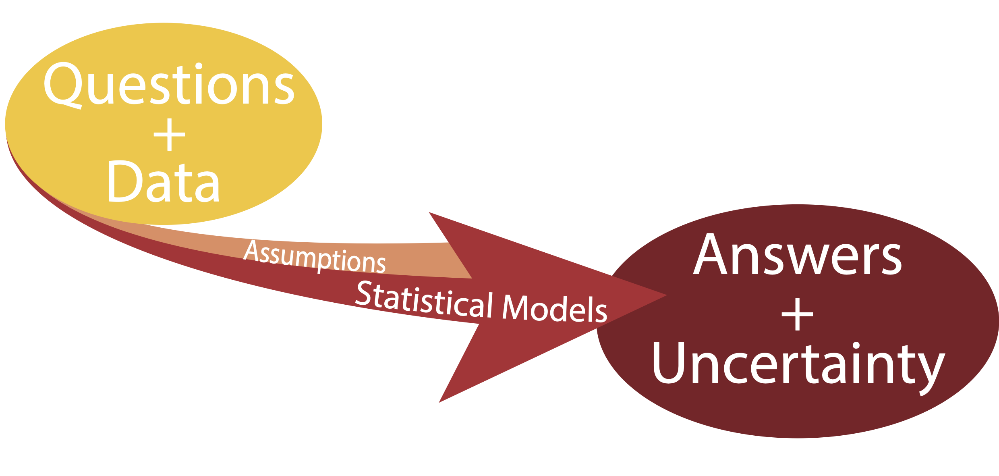
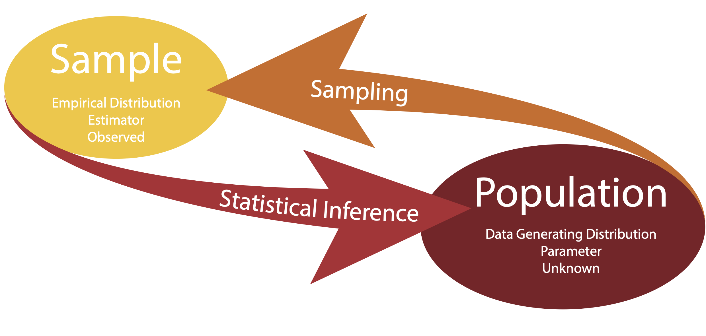

# What is statistics

## What is statistics

::: {.callout-important appearance="minimal"}
Statistics is the *art of making numerical conjectures* about puzzling
questions.

Freedman et al., 1978.
:::

. . .

::: {.callout-important appearance="minimal"}
The objective of statistics is to make *inferences* (predictions,
decisions) *about a population* based on information contained in a
sample.

Mendenhall, 1987.
:::

## What are statistical models {.incremental}

::: {.incremental}
-   Statistical models are sets of equations involving **random
    variables**

-   Statistical models involve **distributional assumptions**

-   Given a **question** and a body of **data** statistical models can
    be used to provide **answers** along with **measures of
    uncertainty**.
:::

## What are statistical models



## Three key concepts: question, model, uncertainty

::: {.callout-important appearance="minimal"}

Far better an **approximate answer to the right question**, which is
often vague, than an **exact answer to the wrong question**, which
can always be made precise.

John W. Tukey, 1962.
:::

. . .

::: {.callout-important appearance="minimal"}

All models are wrong, but some are useful.

George E. P. Box, 1987.
:::

# Statistical Inference

## Statistical Inference

Statistical inference is the process of **learning some properties of the population** starting **from a sample** drawn from this population.

. . .

For instance, we may be interested in learning about the survival
outcome of cancer patients, but we cannot measure the whole population.

. . .

We can however measure the survival of a **random sample** of the
population and then **infer** or generalize the results to the entire
population.

## Statistical Inference

There are some terms that we need to define.

-   The *data generating distribution* is the *unknown* probability
    distribution that generates the data.
-   The *empirical distribution* is the *observable* distribution of the
    data in the sample.

. . .

We are usually interested in a *function* of the data generating
distribution. This is often referred to as *parameter* (or the parameter
of interest).

. . .

We use the sample to estimate the parameter of interest, using a
function of the empirical distribution, referred to as *estimator*.

## Statistical Inference




## Statistical Inference

- *Parameter*: unknown object of interest.

- *Estimator*: data-driven guess at the value of the parameter.

. . .

In terms of mathematical notation, we often use Greek letters to refer
to parameters and we use the same letter with the "hat" notation to
refer to their estimate.

. . .

For instance, we denote with $\hat{\theta}$ the estimator of the
parameter $\theta$.

. . .

Sometimes, you will find the notation $\hat{\theta}_n$, when we want to
emphasize that we are using a sample of $n$ observations to estimate the
parameter.

## Example: Blood pressure in healthy individuals

Let's assume that we want to estimate the average blood pressure of
healthy individuals in the United States.

. . .

Let's assume that we have access to blood pressure measurements for a
random sample of the population (more on this later!).

. . .

- **What is the parameter of interest?**

. . .

- **How can we estimate the parameter using the data in our sample?**

## Data generating distribution

The data generating distribution is unknown.

. . .

In **nonparametric statistics** we aim at estimating this distribution
from the empirical distribution of the sample, without making any
assumptions on the shape of the distribution.

. . .

However, it is often easier to make **some assumptions** about the data
generating distribution. These assumptions are sometimes based on domain
knowledge or on mathematical convenience.

. . .

One commonly used strategy is to assume a **family of distributions** for
the data generating distribution, for instance the *Gaussian
distribution*.


## Random Variables

A variable is a measurement that describe a characteristic of a set of observations.

. . .

A _random variable_ (r.v.) is a variable that measures an intrinsically random process, e.g.
a coin toss.

. . .

Before observing the outcome, we will not know with certainty whether the toss will
yield "heads" or "tails", but that does not mean that we do not know _anything_
about the process: we know that _on average_ it will be heads half of the times
and tails the other half.

. . .

If we refer to $X$ as the process of measuring the outcome of a coin toss, we say
that $X$ is a _random variable_.

## Statistical inference

It is somewhat confusing to talk about random variables in the context of statistical
inference. 

. . .

For instance, let's say that we want to describe the height of a certain population. 
The height of an individual is not a random quantity! We can measure with a certain
amount of precision the height of any individual.

. . .

_What is random is the process of sampling a set of individuals from the population_.

. . .

In other words, the randomness comes from the sampling mechanism, not from the 
quantity that we are measuring: if we repeat the experiment, we will select a different
sample and we will obtain a different set of measurements.


# Statistical modeling

## The art of statistical modeling

- _Start with the data_: exploratory data analysis (EDA).

- _Make probabilistic assumptions_: choose a distribution.

- _Make inference_: estimate the parameters of the distribution.

## A simple example

- When testing certain pharmaceutical compounds, it is important to detect proteins that provoke an allergic reaction. 

- The molecular sites that are responsible for such reactions are called epitopes.

- ELISA assays are used to detect specific epitopes at different positions along a protein.

- The protein is tested at 100 different positions, supposed to be independent.

- We collect data from 50 patients, the reactions are summed at each location.

## Start with the data: EDA

```{r load-data}
library(ggplot2)
theme_set(theme_minimal(base_size = 20))
update_geom_defaults("line", list(linewidth = 1.5))
update_geom_defaults("vline", list(linewidth = 1.5))
update_geom_defaults("hline", list(linewidth = 1.5))

set.seed(1830)

load("data/e100.RData")

df <- data.frame(epitope=e100)
ggplot(df, aes(x = epitope)) +
    geom_bar(fill = "dodgerblue")
```

## Make probabilistic assumptions

- The Poisson distribution is a good model for counting rare events.

- Would its distribution look similar to the one we observe?

- First, we need to recall that the Poisson distribution depends on one parameter, namely $\lambda$, which is also the mean (or expected value) of the distribution.

- We can visually compare the observed distribution with a Poisson, with different values of $\lambda$.

## Check the goodness of fit

Observed data:

```{r}
#| echo: true

table(e100)
```

. . .

Simulated Poisson data ($\lambda = 3$):

```{r, echo=TRUE}
rpois(n = 100, lambda = 3) |>
    table()
```

## Check the goodness of fit

It seems that the simulated data have higher counts than our observed data.

We could try $\lambda = 2$:

```{r, echo=TRUE}
rpois(n = 100, lambda = 2) |>
    table()
```

. . .

We could continue with all possible values of $\lambda$ and choose the one that _minimizes the differences_ between the observed and simulated data.

## Compute the likelihood function

- In other words, we want to compute the _likelihood_ that the data come from the Poisson distribution with a given value of $\lambda$, for any given value.

- Since $\lambda \in \mathbb{R}_+$, it is infeasible to try all possible values, and we can use a more elegant approach that uses the known form of the Poisson distribution to compute it.

## Compute the likelihood function

What we want to compute is the probability that a Poisson r.v. with parameter $\lambda$ will take the observed values. In R:

```{r, echo=TRUE}
dpois(e100, lambda = 3) |>
    prod()
```

. . .

The function that we just computed is called _the likelihood function_ and can be written as
$$
L(\lambda, x) = \prod_{i=1}^n p(x_i),
$$
where $p(x_i)$ is the probability mass function of a Poisson r.v.

## Compute the log-likelihood function

For computational reasons, it is convenient to work with the _log-likelihood_, which sums the log of the pdf, and is usually indicated with the lowercase $\ell$.

$$
\ell(\lambda, x) = \sum_{i=1}^n \log p(x_i).
$$

. . .

In R we can create a function that will compute the log-likelihood for a given value of $\lambda$.

```{r, echo=TRUE}
loglik <- function(lambda, x = e100) {
    sum(dpois(x, lambda, log = TRUE))
}
```

## Search for the best $\lambda$


```{r}
#| echo: true

# Define a grid of lambdas
lambdas = seq(0.05, 0.95, length = 100)

# Compute the log-likelihood
loglikelihood = vapply(lambdas, loglik, numeric(1))

# Find the value that maximizes the log-likelihood
lambda_hat <- lambdas[which.max(loglikelihood)]
df <- data.frame(lambdas, loglikelihood)
p1 <- ggplot(df, aes(lambdas, loglikelihood)) +
    geom_line() +
    geom_vline(xintercept = lambda_hat, col = "red") +
    geom_hline(yintercept = max(loglikelihood), col="blue")
lambda_hat
```

## Search for the best $\lambda$

```{r}
p1
```

## Classical statistics {.smaller}

- What we have just done is to find a value of the parameter that maximizes the log-likelihood function.

- Maths tells us that to find the maximum (or minimum) of a function we can compute its derivative.

- In this case, the log-likelihood function is easy to compute from the Poisson pdf:
$$
p(x) = \frac{1}{x!}\lambda^x e^{-\lambda}.
$$

- Hence
$$
\ell(\lambda, x) = \sum_{i=1}^n -\lambda + x_i \log \lambda - \log(x_i!)
$$

## Classical statistics {.smaller}

- We obtain
$$
\ell(\lambda, x) = -n \lambda + \log \lambda \sum_{i=1}^n x_i - c,
$$

- from which we can derive
$$
\frac{d \ell}{d\lambda} = -n + \frac{1}{\lambda} \sum_{i=1}^n x_i,
$$

- that leads to
$$
\hat{\lambda} = \frac{1}{n} \sum_{i=1}^n x_i.
$$

- Hence, the sample mean.

## Maximum Likelihood Estimation

- We have just seen one of the most important procedures of statistical inference: _Maximum Likelihood Estimation_.

- We call $\hat{\lambda}$ the _maximum likelihood estimate (MLE)_.

- In the case of the Poisson distribution, the MLE is the mean of the sample.

- Maximum Likelihood Estimation is a staple of modern statistics. We will see that in more complex models, we do not have a closed form solution for it and we will need to rely on numerical algorithms.

## Another example

Suppose that we take a sample of $n = 120$ males and test them for color blindness.

. . .

We can code with $x_i=0$ if subject $i$ is not colorblind, and with $x_i = 1$ if subject $i$ is colorblind.

. . .

Suppose that we obtain the data summarized in the following table.

```{r}
cb <- c(rep(0, 110), rep(1, 10))
table(cb)
```

## Another example

- Assume that the data arise from a binomial r.v. with $n=120$ trials and unknown success probability $p$.
- What is your best guess at the value of $p$? Why?
- Use the `dbinom` function in R to compute the likelihood for a grid of values of $p$ and determine numerically the MLE.
- Plot the log-likelihood function.
- Recall that the binomial pdf is
$$
p(x) = \binom{n}{x} p^x (1-p)^{(n-x)}
$$
- Use the derivative of the log-likelihood to compute the MLE.

## To sum up

- A statistical model uses probability distributions and random variables to provide a _generative mechanism_ for the data that we observe.

- Random variables are used to account for the statistical randomness that we have in our observed samples.

- It is important to think carefully about what _assumptions_ we are relying on when specifying a statistical model.

## To sum up

- The Maximum Likelihood Estimate (MLE) is the value of the parameter that maximizes the likelihood that the data arise from that distribution.

- We obtain the MLE by maximizing the log-likelihood.

- In simple models, we can use the derivative of the log-likelihood to obtain a _closed-form_ estimate of the parameter.

- In more complex models, we need to rely on numerical methods to maximize the log-likelihood.

