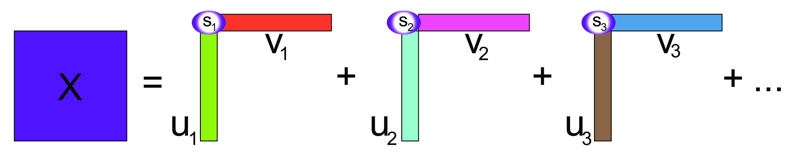

# Introduction

## Unsupervised vs. supervised problems

So far, we have focused on "supervised" problems, in which we have a _response_ variable that we want to explain/predict using other variales (_covariates_).

. . .

However, many practical problems are _unsupervised_ in nature, meaning that all the variables have the same role and the main goal is to describe/explore the relations among the variables.

. . .

Even when we do have a _response_, it may be useful to use unsupervised techniques for _exploratory data analysis_ prior to modeling.

## Multivariate Analysis

Suppose that we have a $n \times p$ matrix $X$ containing $n$ observations for which we recorded $p$ numerical variables.

. . .

When we have two variables ($p=2$), say height and weight, it is natural to represent the observations as points in a two-dimensional space.

. . .

We can generalize this by thinking of the $n$ observations (the rows of a data matrix) as points in a $p$-dimensional space.

## The curse of dimensionality

It is impossible to _visualize_ the data when $p>3$, and it is in general very hard for humans to reason in more than three-dimensional space.

. . .

Moreover, the _curse of dimensionality_ states that the more we increase the number of dimensions the less effective Euclidean distances are to identify the similarities between data points.

. . .

One way to think about the curse of dimensionality is: if the space is big enough, no single point will be close to any other point, for a reasonable definition of "closeness".

## Dimensionality reduction

If we had a way to reduce in some way the dimensionality of the data, we could simplify the problem.

. . .

In general, this will lead to information loss, but we can try to __preserve as much information as possible__.


## Not all variables are useful...

Suppose that we have measured the length and the width of 12 objects and the results are reported in the following table.

```{r}
mock1 <- data.frame(length = c(246.45, 165.64, 305.35, 302.72, 420.58, 550.15, 291.66, 187.26, 691.57, 273.75, 382.57, 338.83),
                    width  = rep(44, 12))
mock1
```

## Not all variables are useful...

If we want to look at the _variability_ of the data, the variable `width` is useless.

In other words, it does not contribute to the differences between the objects.

## A slightly different example

```{r}
set.seed(222123)
mock2 <- data.frame(length = c(246.45, 165.64, 305.35, 302.72, 420.58, 550.15, 291.66, 187.26, 691.57, 273.75, 382.57, 338.83),
                    width  = round(jitter(rep(44, 12)), 2))
mock2
```

While `width` is not constant, `length` _explains_ or _captures_ much better the differences between the objects.

## A slightly different example

In these cases, dropping the `width` variable and focusing only on `length` would be a reasonable way to _reduce the dimensionality_ of the dataset from two to one. 

## Yet another example

```{r}
mock3 <- data.frame(length = c(246.45, 165.64, 305.35, 302.72, 420.58, 550.15, 291.66, 187.26, 691.57, 273.75, 382.57, 338.83),
                    width  = c(117.92, 93.68, 135.59, 134.81, 170.16, 209.06, 131.51, 100.18, 251.46, 126.14, 158.79, 145.64))
mock3
```

Do you notice anything?

## Yet another example

```{r}
library(ggplot2)
theme_set(theme_minimal(base_size = 20))


ggplot(mock3, aes(length, width)) +
    geom_point() +
    coord_equal()
```

## The interesting direction...

```{r}
pca <- prcomp(as.matrix(mock3))
mu <- colMeans(mock3)           # centroid (where axes cross)
v1 <- pca$rotation[, "PC1"]     # direction of PC1 in (length, width) space
v2 <- pca$rotation[, "PC2"]     # direction of PC2 in (length, width) space

# Slopes of the PC axes (handle vertical just in case)
slope1 <- if (abs(v1[1]) < 1e-12) Inf else v1[2] / v1[1]
slope2 <- if (abs(v2[1]) < 1e-12) Inf else v2[2] / v2[1]

# Intercepts so the lines pass through the centroid
int1 <- mu["width"] - slope1 * mu["length"]
int2 <- mu["width"] - slope2 * mu["length"]

df_label <- data.frame(label = c("PC1", "PC2"),
                        x = c(700, 300),
                        y = c(225, 225))

ggplot(mock3, aes(length, width)) +
  geom_point(size = 2) +
  # PC1 axis
  (if (is.finite(slope1)) geom_abline(slope = slope1, intercept = int1, linetype = "dashed") 
   else geom_vline(xintercept = mu["length"], linetype = "dashed")) +
  labs(x = "length", y = "width") +
  coord_equal()
```

## Let's rotate the axes...

```{r}
ggplot(mock3, aes(length, width)) +
  geom_point(size = 2) +
  # PC1 axis
  (if (is.finite(slope1)) geom_abline(slope = slope1, intercept = int1, linetype = "dashed") 
   else geom_vline(xintercept = mu["length"], linetype = "dashed")) +
  # PC2 axis
  (if (is.finite(slope2)) geom_abline(slope = slope2, intercept = int2, linetype = "dashed") 
   else geom_vline(xintercept = mu["length"], linetype = "dashed")) +
  labs(x = "length", y = "width") +
  geom_text(aes(x, y, label=label), data=df_label, size = 5) +
  coord_equal()
```

## Treating the new axes as variables

```{r}
round(pca$x, 2)
```

## Interpretation of the new variables

The new variable `PC1` represents the **global dimension** of the object.

The new variable is _centered_, meaning that the mean is zero, and positive and negative values correspond to "large" and "small" objects, respectively.

. . .

The new variable `PC2` is almost useless as it is "almost zero" for all objects.

This is an example of __Principal Component Analysis (PCA)__.

## PCA as dimensionality reduction

PCA can be interpreted geometrically as a rotation of the original axes, but in statistics it is often used as a way to _reduce the dimensionality of the problem_.

. . .

The example that we just saw is a good example of that: now that we know that we have seen that the second new variable does not explain much of the variability of the data, we can drop it and keep only the first one.

## Principal Components

The "new variables" that we have discussed are called __Principal Components__.

The first principal component of the data, `PC1`, is obtained by minimizing the sum of squares of the orthogonal (perpendicular) projections of data points onto it.

## Principal Components

```{r}
xy = as.matrix(mock3)
svda = svd(xy)
pc = xy %*% svda$v[, 1] %*% t(svda$v[, 1])
bp = svda$v[2, 1] / svda$v[1, 1]
ap = mean(pc[, 2]) - bp * mean(pc[, 1])
ggplot(mock3, aes(length, width)) +
  geom_point(size = 2) +
  geom_segment(xend = pc[, 1], yend = pc[, 2]) +
  geom_abline(intercept = ap, slope = bp, col = "purple", linewidth = 1.5) +
  coord_equal() +
  ylim(c(50, 300))
```

## Principal Components

Pythagoras’ theorem tells us that the total variability of the points is measured by the sum of squares of the projection of the points onto the center of gravity.

. . .

For a fixed variance, minimizing the projection distances also maximizes the variance along that line.

. . .

Often we define the first principal component as the **direction with maximum variance**.

## Principal Components

We can define the first _principal component_ as the _linear combination_ of the $p$ original variables
$$
Y_1 = a_{11} X_1 + a_{12} X_2 + \ldots + a_{1p} X_p
$$
that captures most of the variability of the data.

## Principal Components

The second principal component is the linear combination of the original variables
$$
Y_2 = a_{21} X_1 + a_{22} X_2 + \ldots + a_{2p} X_p
$$
that explains the most variability among the directions _orthogonal_ to the first PC.

## Example: the athletes data

This dataset reports the performances for 33 athletes in the ten disciplines of the decathlon: 

- m100, m400 and m1500 are times in seconds for the 100 meters, 400 meters, and 1500 meters respectively;
- m110 is the time to finish the 110 meters hurdles; 
- pole is the pole-vault height, and high and long are the results of the high and long jumps, all in meters; 
- weight, disc, and javel are the lengths in meters the athletes were able to throw the weight, discus and javelin.

## Example: the athletes data

```{r}
data("olympic", package = "ade4")
athletes = setNames(
  olympic$tab,
  c(
    "m100",
    "long",
    "weight",
    "high",
    "m400",
    "m110",
    "disc",
    "pole",
    "javel",
    "m1500"
  )
)
athletes[1:10, ]
```

## Example: the athletes data

```{r}
#| echo: true
pca_athletes <- prcomp(athletes, scale. = TRUE)
pca_athletes$rotation[,1:2]
```

How do you interpret the first PC? The second?

## The biplot

```{r}
library(ggbiplot)
ggbiplot(pca_athletes)
```

## Transforming the data

Unlike the other disciplines, for running the higher the "score" (time) the worse the performance.

Let's transform the variable so that higher scores will be better, by simply multiplying by -1.

## New biplot

```{r}
runningvars <- grep("^m", colnames(athletes), value = TRUE)
athletes[, runningvars] = -athletes[, runningvars]
pca_athletes <- prcomp(athletes, scale. = TRUE)
ggbiplot(pca_athletes)
```

## Interpretation

```{r}
#| echo: true
pca_athletes$rotation[,1:2]
```

How do you interpret the first PC? The second?

## PC1 captures the final results

```{r}
ggplot(
  data = data.frame(
    PC1 = pca_athletes$x[, 1],
    score = olympic$score,
    label = rownames(athletes)
  ),
  mapping = aes(y = score, x = PC1)
) +
  geom_text(aes(label = label)) +
  stat_smooth(method = "lm", se = FALSE)
```

## More formal definition

Let $X$ be a $p$-dimensional random vector with mean $\mu$ and covariance matrix $\Sigma$.

The _principal component transformation_ of $X$ is defined as the standardized linear combination 
$$
Y = \Gamma^{\top}(X - \mu).
$$

## More formal definition

From the Spectral Decomposition Theorem, 

- $\Gamma^{\top} \Sigma \Gamma = \Lambda$, 
- $\Lambda = \text{Diag}(\lambda_j: j=1,\dotsc,p)$ is the diagonal matrix of _eigenvalues_ of $\Sigma$, $\lambda_1 \geq \lambda_2 \geq \dotsc \geq \lambda_p \geq 0$, and 
- $\Gamma = (\gamma_j: j=1,\dotsc,p)$ is an orthogonal matrix whose columns $\gamma_j$ are the corresponding _eigenvectors_. 

## More formal definition

The _$j$th principal component_ ($j$th PC or $PC_j$) of $X$ is then
$$
Y_j = \gamma_j^{\top}(X-\mu),
$$

where the $j$th eigenvector $\gamma_j$ is referred to as the _$j$th vector of principal component loadings_.

## Example: the athletes data

```{r}
#| echo: true

# Principal components (scores)
head(pca_athletes$x)
```

## Example: the athletes data

```{r}
#| echo: true

# Loadings
head(pca_athletes$rotation)
```


## PCA properties {.smaller}

The principal components satisfy the following properties.

1.
$$
E[Y] = 0,
$$

2.
$$
\text{Cov}(Y) = \Lambda = \text{Diag}(\lambda_j: j=1,\dotsc,p)
$$
and, in particular,
$$
\text{Var}(Y_1) \geq \text{Var}(Y_2) \geq \dotsc \geq \text{Var}(Y_p).
$$
3.
$$
\sum_{j=1}^p \text{Var}(Y_j) = \text{tr}(\Sigma) = \sum_{j=1}^p \lambda_j.
$$
4.
$$
\prod_{j=1}^p \text{Var}(Y_j) = |\Sigma| = \prod_{j=1}^p \lambda_j.
$$

## Example: the athletes data

```{r}
#| echo: true

# Zero mean
round(colMeans(pca_athletes$x), 2)

# covariance matrix is diagonal
round(cov(pca_athletes$x), 2)
```


## PCA properties

The principal components are _not scale-invariant_!

Depending on the types of variables under consideration, scaling or use of the correlation matrix instead of the covariance matrix may be in order.


## PCA properties

The _proportion of total variation explained_ by the first $K$ principal components is given by
$$
p_K = \frac{\sum_{j=1}^K \lambda_j}{\sum_{j=1}^p \lambda_j}.
$$

The _scree plot_, i.e., a plot of $\lambda_j$ vs. $j$, can be used to determine how many components to use (stop at "elbow").

## Example: the athletes data

```{r}
summary(pca_athletes)
```

## Screeplot

```{r}
ggbiplot::ggscreeplot(pca_athletes)
```

## How to compute PCA

Recall that the principal components are linear combinations of the $p$ original variables that explain the most variability in the data. E.g., 
$$
Y_1 = a_{11} X_1 + a_{12} X_2 + \ldots + a_{1p} X_p.
$$

But how can we find the coefficients $a_{1j}$?

## Singular Value Decomposition (SVD) {.smaller}

Singular Value Decomposition (SVD) is a fundamental linear algebra technique that factorizes any $n \times p$ matrix $X$ as
$$
X = U D V^{\top},
$$
where 

- $U$ is a $n \times p$ orthogonal matrix ($U^{\top} U = I$), whose columns are called _left singular vectors_ of $X$,
- $V$ is a $p \times p$ orthogonal matrix ($V^{\top} V = I$), whose columns are called _right singular vectors_ of $X$, and
- $D$ is a $p \times p$ diagonal matrix with diagonal elements $d_1 \geq d_2 \geq \ldots \geq d_p \geq 0$, called _singular values_ of $X$.

## Intuition for SVD

The intuition behind SVD is that it decomposes $X$ into a sum of rank-one matrices, obtained by multiplying the columns of $U$ and $V$, weighted by the diagonal elements of $D$.



## SVD and PCA

The singular vectors from SVD contain the coefficients of the linear combinations of the original variables that define the principal components.

In practice, we can compute the principal components as $U D$.

## Example: the athletes data

```{r}
#| echo: true
X <- scale(as.matrix(athletes), center = TRUE, scale = TRUE)
svdX <- svd(X)

# Principal components
head(svdX$u %*% diag(svdX$d))[,1:2]
head(pca_athletes$x)[,1:2]

# Loadings
head(svdX$v)[,1:2]
head(pca_athletes$rotation)[,1:2]
```

## PCA as exploratory tool

We have seen that unlike regression, PCA treats all variables equally.

 However, it is still possible to map other continuous variables or categorical factors onto the plots in order to help interpret the results. 
 
Often we have complementary information on the samples and looking at the observations in the space of the first few PCs can be a valuable exploratory data analysis tool.

## Example: Cell types

Holmes et al. (2005) studied gene expression profiles of sorted T-cell populations from different subjects. 

The columns are a subset of gene expression measurements, they correspond to 156 genes that show differential expression between cell types.

```{r}
load("data/Msig3transp.RData")
round(Msig3transp, 2)[1:5, 1:6]
```

## Example: Cell types

```{r}
pca_ct <- prcomp(Msig3transp, scale. = TRUE)

ids = rownames(Msig3transp)
celltypes = factor(substr(ids, 7, 9))
status = factor(substr(ids, 1, 3))

cbind(pca_ct$x, data.frame(Cluster = celltypes, sample = ids)) |>
  ggplot(aes(x = PC1, y = PC2)) +
  geom_point(aes(color = Cluster), size = 5) +
  geom_hline(yintercept = 0, linetype = 2) +
  geom_vline(xintercept = 0, linetype = 2) +
  scale_color_discrete(name = "Cluster") +
  coord_fixed()
```