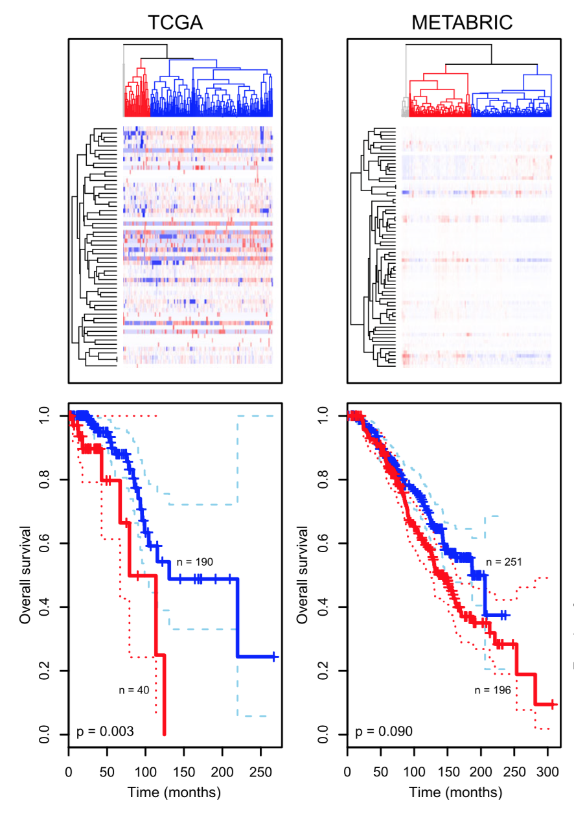
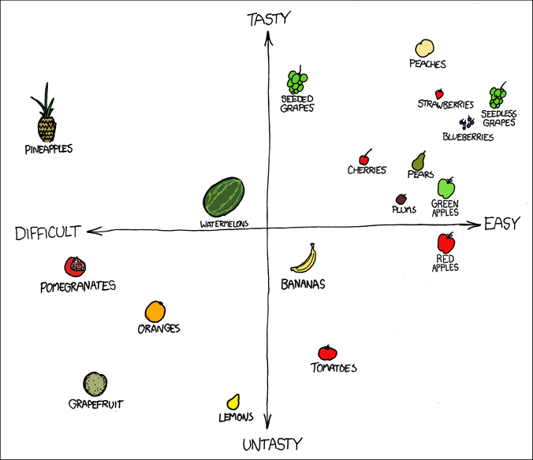
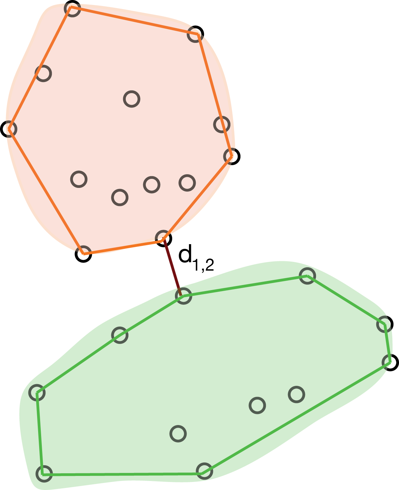
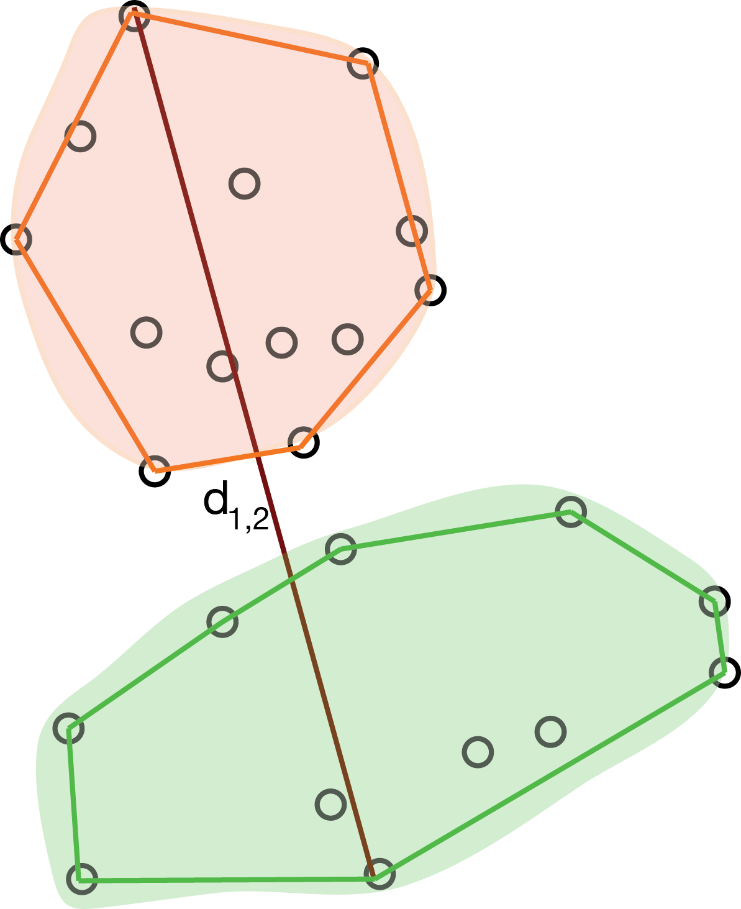
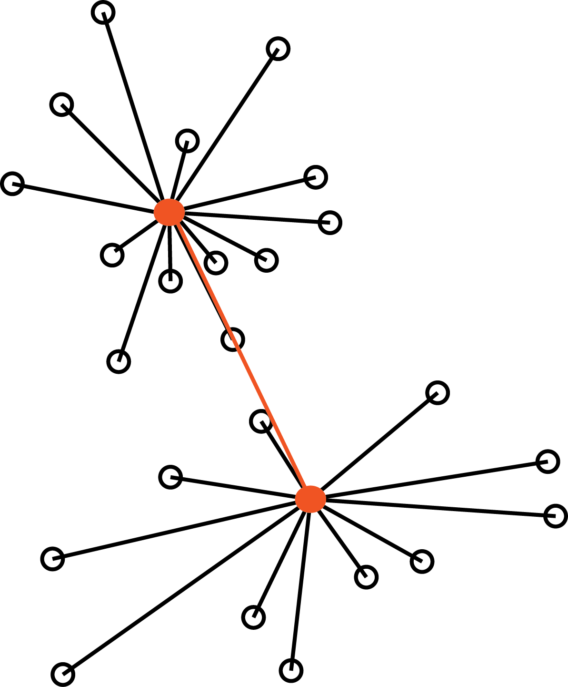

# Introduction

## Classification

We have seen logistic regression as a special case of GLM.

. . .

In logistic regression, our response variable is _binary_ and the result of the regression model fitting can be seen as a _prediction_ of the probability that each observation belong to one of two classes.

. . .

This sometimes takes the names of **classification**.

## Supervised classification

In logistic regression, we know the values of the binary response.

. . .

In other words, we know the _labels_ of the observations, i.e., to which of the two classes each observation belongs.

. . .

You will see many more classification examples in the machine learning class.

## Unsupervised classification

Here, we focus on _unsupervised classification_, in which we do not know the labels of the observations in advance.

. . .

This class of problems is also called **clustering**.

. . .

The goal of clustering is to classify observations into discrete groups, without knowing the group labels, _nor the number of groups_.

## Why clustering?

Clustering problems are often posed in a vague way: _"let's group the data and see what the groups tell us."_

. . .

Other times, this is done to simplify complex measurements: for instance, by grouping tumor samples we can define _molecular subtypes_ that can be used for treatment decision making.

. . .

In yet other instances, we conceptualize our observations as noisy versions of idealized objects: e.g., we hope that by clustering single cells, our groups represent cell types.

## Clustering as a discovery tool


## Clustering as a discovery tool

In 1855, the English physiscian John Snow made a map of cholera cases and identified spatial _clusters_ of cases. 

. . .

The proximity of dense clusters of cases to the Broadstreet pump pointed to its water as a possible culprit. 

. . .

Clustering enabled him to infer the source of the cholera outbreak.

## Clustering as a discovery tool

Another example is how clustering has enabled researchers to enhance their understanding of cancer biology.

. . .

Tumors that appear to be the same based on their anatomical location and histopathology can be grouped into multiple clusters based on their molecular signatures, such as gene expression data.

## Clustering as a discovery tool



## Intuition of clustering

Intuitively, with clustering we try to group together **similar observations**.

. . .

But how do we define similarity?

## Similarity


Are the rows or the columns more similar to each other?

# Distance

## Distance as a measure of similarity




## Distance as dissimilarity

We have seen in our PCA lecture that we can think of observations as points in a multi-dimensional space defined by the variables that we measure on them.

. . .

It is intuitive to think that by measuring the distance between object in such a space will provide a way to group them.

. . .

But... **this is easier said than done!**

## Where do we start...?

- Do we need all the variables or only a subset of them?
- Do we need to transform the variables? 
    - Are they on the same scale? 
    - Do they have a very skewed distribution?
    - Should they all contribute equally to the clustering? (cf. standardization)
- Which distance should I use? 

## Euclidean distance

::: {.callout-important}

# Definition

The Euclidean distance between two points $x =  [x_{1} \, \ldots \, x_{p}]$ and $y =  [y_{1} \, \ldots \, y_{p}]$ in a $p$-dimensional space is the square root of the sum of squares of the differences in all coordinate directions:
$$
d(x, y) = \sqrt{(x_1 - y_1)^2 + (x_2 - y_2)^2 + \ldots + (x_p - y_p)^2}.
$$
:::

## Euclidean distance

```{r}
library(ggplot2)
theme_set(theme_minimal(base_size = 20))

# Define two points
p1 <- data.frame(x = 1, y = 1)
p2 <- data.frame(x = 4, y = 3)

# Data for segments (horizontal, vertical, and diagonal)
segments <- data.frame(
  x = c(p1$x, p2$x, p1$x),
  y = c(p1$y, p1$y, p1$y),
  xend = c(p2$x, p2$x, p2$x),
  yend = c(p1$y, p2$y, p2$y),
  type = c("a", "b", "distance")
)

ggplot() +
  geom_point(data = rbind(p1, p2), aes(x, y), size = 3) +
  geom_segment(data = segments,
               aes(x = x, y = y, xend = xend, yend = yend, linetype = type),
               linewidth = 1) +
  annotate("text", x = p1$x, y = p1$y - 0.2, label = "x") +
  annotate("text", x = p2$x, y = p2$y + 0.2, label = "y") +
  annotate("text", x = (p1$x + p2$x)/2, y = p1$y - 0.3, label = "y2 - x2") +
  annotate("text", x = p2$x + 0.2, y = (p1$y + p2$y)/2, label = "y1 - x1") +
  coord_equal() +
  labs(x = "var 1", y = "var 2") +
  scale_linetype_manual(values = c("dashed", "dashed", "solid")) +
  theme(legend.position = "none")
```

$$
d(x, y)^2 = (y_1 - x_1)^2 + (y_2 - x_2)^2.
$$

## Example: flow cytometry

At different stages of their development, immune cells express unique combinations of proteins on their surfaces. These protein-markers can be collected by flow cytometry (using fluorescence).

. . .

An example of a commonly used marker is CD4, which is expressed by helper T cells. Another one is CD3, which is expressed by all mature T cells. Hence, we can define CD4+ T cells as those cells that express both CD3 and CD4 markers.

. . .

Our dataset includes 91,392 cells and 41 markers.

## Example: flow cytometry

```{r}
library(flowCore)
library(flowViz)
fcsB = read.FCS("data/Bendall_2011.fcs", truncate_max_range = FALSE)
markersB = readr::read_csv("data/Bendall_2011_markers.csv")
mt = match(markersB$isotope, colnames(fcsB))
stopifnot(!any(is.na(mt)))
colnames(fcsB)[mt] = markersB$marker
asinhtrsf = arcsinhTransform(a = 0.1, b = 1)
fcsBT = transform(fcsB, transformList(colnames(fcsB)[-c(1, 2, 41)], asinhtrsf))

flowPlot(fcsBT, plotParameters = c("CD3all", "CD4"), logy = FALSE)
```

## Flow cytometry (first 10 cells)

```{r}
library(ggrepel)
as.data.frame(exprs(fcsBT)) |>
  dplyr::select(CD3all, CD4) |>
  head(n = 10) -> cd10

ggplot(cd10, aes(x = CD3all, y = CD4)) +
  geom_point() +
  geom_text_repel(label = 1:10) +
  coord_equal()
```

## Flow cytometry (first 10 cells) {.smaller}

Compute the distance in R.

```{r}
#| echo: true
dist(cd10)
```

## Other distances

The Euclidean distance is a natural choice, but not the only options.

. . .

There are many different distance metrics that we can use, here we see a few options.

## Hamming distance

Not all data are numbers!

. . .

For instance, we may be interested in clustering DNA sequences (e.g., in evolutionary biology).

. . .

The simplest way to compute distances between character strings is the _Hamming distance_ (aka the Edit distance): it simply counts the number of differences between two character strings.

## Jaccard distance

When we have binary data, e.g., presence / absence of a certain feature, co-occurence is often more informative than co-absence, espetially when the events are rare.

. . .

Let’s call $f_{11}$ the number of times a feature co-occurs both in $x$ and $y$, $f_{10}$ (and $f_{01}$) the number of times a feature occurs in $x$ but not in $y$ (and vice versa), and $f_{00}$ the number of times a feature is co-absent.

. . .

The Jaccard Index is 
$$
J(x, y) = \frac{f_{11}}{f_{01} + f_{10} + f_{11}}.
$$

## Jaccard Index

Note that the Jaccard Index corresponds to the size of the _intersection_ of two sets divided by the size of their _union_ and is a natural way of measuring the similarity of two sets.

$$
J(A, B) = \frac{|A \cap B|}{|A \cup B|}.
$$

The Jaccard distance is
$$
d(x, y) = 1 - J(x, y).
$$

# Partitional methods

## k-means

K-means is probably the most widely used clustering algorithm. 

It starts from pre-specifying the number of clusters, $k$.

The main idea is to _partition_ the $n$ observations into $k$ groups so that the groups are those that **minimize the within-group sum of squares** (i.e., the within-group Euclidean distance).

## k-means

Naively, one could try _all possible groups_ and choose the one that minimizes the sum of squares.

However, we have ${n \choose k}$ possible ways to group $n$ observations into $k$ groups.

:::{.callout-note}
Note that ${n \choose k} = \frac{n!}{k!(n-k)!}$.

```{r}
#| echo: true
choose(10, 4)
choose(100, 4)
choose(1000, 4)
```
:::

## k-means algorithm {.smaller}

1. Randomly initialize $K$ centroids, $\mu_1, \ldots, \mu_K$.

2. Assign each observation $i$ to the centroid $k$ that minimizes
$$
c_i = \arg \min_k \sum_{j=1}^p (x_{ij} - \mu_{kj})^2 = || x_i - \mu_k||^2.
$$

3. For each group $k$, compute the new centroid as
$$
\mu_k = \frac{\sum_{i=1}^n \mathbb{1}_{c_i=k} x_i}{\sum_{i=1}^n \mathbb{1}_{c_i=k}},
$$
where 
$$
\mathbb{1}_{c_i=k} = \begin{cases} 
1 & \text{if } c_i = k, \\
0 & \text{otherwise.}
\end{cases}
$$

## Example: k-means

```{r}
#| echo: true
assign_centroids <- function(x, centroids) {
  apply(x, 1, function(xi) {
    which.min(apply(centroids, 1, function(mu) sum((xi - mu)^2)))
  })
}

compute_centroids <- function(x, labels, k) {
  t(vapply(1:k, function(i) colMeans(x[labels == i,]), numeric(ncol(x))))
}
```

## Example: k-means {.smaller}

```{r}
#| echo: true
# pick random centroids
(centroids <- cd10[1:3,])
```

```{r}
p_cd10 <- ggplot(cd10, aes(x = CD3all, y = CD4)) +
  coord_equal() 

p_cd10 + 
  geom_point() +
  geom_point(data = as.data.frame(centroids), aes(x = CD3all, y = CD4), color = "red", size = 3) +
  geom_text_repel(data = as.data.frame(centroids), aes(x = CD3all, y = CD4), label = paste0("centroid ", 1:3), color = "red")

```

## Example: k-means {.smaller}

```{r}
#| echo: true

# assign observations to centroids
(labels <- assign_centroids(cd10, centroids))
```

```{r}
p_cd10 + 
  geom_point(data = cbind(cd10, labels=paste0("cluster", labels)), aes(x = CD3all, y = CD4, color = labels))
```

## Example: k-means {.smaller}

```{r}
#| echo: true

# compute new centroids
(centroids <- compute_centroids(cd10, labels, k = 3))
```

```{r}
p_cd10 + 
  geom_point() +
  geom_point(data = as.data.frame(centroids), aes(x = CD3all, y = CD4), color = "red", size = 3) +
  geom_text_repel(data = as.data.frame(centroids), aes(x = CD3all, y = CD4), label = paste0("centroid ", 1:3), color = "red")
```

## Example: k-means {.smaller}

```{r}
#| echo: true

# assign observations to new centroids
(labels <- assign_centroids(cd10, centroids))
```

```{r}
p_cd10 + 
  geom_point(data = cbind(cd10, labels=paste0("cluster", labels)), aes(x = CD3all, y = CD4, color = labels))
```

## Example: k-means {.smaller}

```{r}
#| echo: true

# compute new centroids
(centroids <- compute_centroids(cd10, labels, k = 3))
```

```{r}
p_cd10 + 
  geom_point() +
  geom_point(data = as.data.frame(centroids), aes(x = CD3all, y = CD4), color = "red", size = 3) +
  geom_text_repel(data = as.data.frame(centroids), aes(x = CD3all, y = CD4), label = paste0("centroid ", 1:3), color = "red")
```

## Example: k-means {.smaller}

```{r}
#| echo: true

# assign observations to new centroids
(labels <- assign_centroids(cd10, centroids))
```

```{r}
p_cd10 + 
  geom_point(data = cbind(cd10, labels=paste0("cluster", labels)), aes(x = CD3all, y = CD4, color = labels))
```

## Example: k-means {.smaller}

```{r}
#| echo: true

# compute new centroids
(centroids <- compute_centroids(cd10, labels, k = 3))
```

```{r}
p_cd10 + 
  geom_point() +
  geom_point(data = as.data.frame(centroids), aes(x = CD3all, y = CD4), color = "red", size = 3) +
  geom_text_repel(data = as.data.frame(centroids), aes(x = CD3all, y = CD4), label = paste0("centroid ", 1:3), color = "red")
```

## Example: k-means {.smaller}

```{r}
#| echo: true

# assign observations to new centroids
(labels <- assign_centroids(cd10, centroids))
```

```{r}
p_cd10 + 
  geom_point(data = cbind(cd10, labels=paste0("cluster", labels)), aes(x = CD3all, y = CD4, color = labels))
```

## Randomness of k-means

The k-means algorithm is not deterministic, because of the random initialization of the centroids.

. . .

Hence, every time you run the algorithm, you may get different results. It is good practice to run the algorithm multiple times and select the solution that minimizes the within-group sum of squares.

## K-means in R

```{r}
#| echo: true

set.seed(2258)
(km <- kmeans(cd10, centers = 3, nstart = 10))
```

## The curse of dimensionality

In this simple example, we have only two variables and we can easily compute the distance between observations in a two-dimensional space.

. . .

When dealing with high-dimensional data, the curse of dimensionality makes it less effective to cluster points based on their Euclidean distance.

. . .

Hence, it is often useful to perform dimensionality reduction, and perform k-means clustering in the reduced space (e.g, by using the first few principal components).

## Evaluating clustering results

The main problem with any clustering algorithm is that, directly or indirectly, we need to set the number of clusters.

. . .

As with any algorithm, if we ask for clusters, we will get clusters. But how do we evaluate if the results reflect the underlying structure of the data?

. . .

Evaluating clustering results is an active area of research in statistics. Here, we will discuss only two simple metrics that may be useful to compare values of $k$ or to get an overall assessment of the clustering performance.

## The silhouette width

The **silhouette width** of observation $i$ is defined as
$$
sil(i) = \frac{b(i) - a(i)}{\max\{a(i), b(i)\}} \in [-1, 1],
$$

where

- $a(i)$ is the average distance between $i$ and all other observations in the same cluster;
- $b(i)$ is the average distance between $i$ and all the observations of the closest cluster to which $i$ does not belong.

## The silhouette width

A high positive value of silhouette indicates that clusters are well separated and well cohesive.

. . .

We can use the silhouette to _choose the number of clusters_, by selecting the value of $K$ that maximizes the silhouette index.

. . .

We can look at the average silhouette width for each cluster, and the average silhouette width across all clusters.

## Example

```{r}
#| echo: true

library(cluster)
(sil <- silhouette(labels, dist(cd10)))
```

## Example

```{r}
plot(sil)
```

## The Rand Index

When we want to compare two partitions, we can use the _Rand index_.

This could be useful, for instance, to:

- Compare two different clustering algorithmns;
- Compare the results of a clustering algorithm to ground truth labels.

## The Rand Index {.smaller}

Given two partitions $R = \{R_1, \ldots, R_p\}$ and $S = \{S_1, \ldots, S_q\}$, the Rand Index is defined as

$$
R = \frac{a + b}{a + b + c + d} = \frac{a + b}{{n \choose 2}},
$$

where

- $a$ is the number of pairs of elements that are in the same cluster in both $R$ and $S$.
- $b$ is the number of pairs of elements that are in different clusters in both $R$ and $S$.
- $c$ is the number of pairs of elements that are in the same cluster in $R$ but in different clusters in $S$.
- $d$ is the number of pairs of elements that are in the same cluster in $S$ but in different clusters in $R$.

## The Rand Index

Mathematically, $a$ is the cardinality of $\mathcal X^\prime$ and $b$ is the cardinality of $\mathcal X^{\prime\prime}$, where

$$
\mathcal X^\prime = \{(x_i, x_j) : x_i, x_j \in R_k; x_i, x_j \in S_l \}
$$

and

$$
\mathcal X^{\prime\prime} = \{(x_i, x_j) : x_i \in R_{k_1}, x_j \in R_{k_2}; x_i \in S_{l_1}, x_j \in S_{l_2} \}
$$

Intuitively, the sum of $a$ and $b$ represents the number of times that the two partitions agree.

## Adjusted Rand Index

The Rand Index ranges between 0 and 1, where 0 indicates complete disagreement and 1 complete agreement.

. . .

Obviously, if we compare two partitions, it is likely that the two partitions agree by chance for some pairs of observations.

. . .

There is an "adjusted" version of the Rand Index that takes into account this element of randomness and that is equal to 0 when the two partitions do not agree more than expected by chance between two random partitions.

## Example

Let's compare our manual k-means solution to the one obtained by the kmeans function in R.

```{r}
#| echo: true
cbind(labels, km$cluster)

library(mclust)
adjustedRandIndex(labels, km$cluster)
```

# Hierarchical clustering

## Hierarchical clustering

A different approach to clustering is to start from the observations and iteratively merge the closest ones into larger and larger groups, until all observations belong to the same group.

. . .

This allows us to avoid pre-specifying the number of clusters, and the result that we will get is not a single partition, but a _hierarchy_ of partitions, that we can visualize with a _dendrogram_.

## Example

```{r}
d <- dist(cd10)
hc <- hclust(d)
plot(hc)
```

## Distance between groups {.smaller}

While intuitive, this method requires the definition of a distance between groups of observations, in order to decide which groups to merge at each step.

. . .

In fact, you can imagine several ways to define such distance:

- the distance between the closest observations in the two groups;
- the distance between the farthest observations in the two groups;
- the average distance between all pairs of observations in the two groups;
- the distance between the centroids of the two groups.

## Single linkage

The **single linkage** method defines the distance between two groups as the distance between the closest observations in the two groups.



## Complete linkage

The **complete linkage** method defines the distance between two groups as the distance between the farthest observations in the two groups.



## The Ward method

The **Ward method** defines the distance between two groups as the increase in the within-group sum of squares that would result from merging the two groups (sum of squared distances between data points and their cluster centroid).



## Which method to choose?

The single linkage tend to create long clusters that look like long strings of points, while the complete linkage tends to create compact clusters.

The Ward method gives often good results in practice, but may result in smaller cluster sizes.

## Example

```{r}
#| echo: true

d <- dist(cd10)
hclust(d, method = "single") |> plot(main = "Single linkage")
```

## Example

```{r}
#| echo: true

d <- dist(cd10)
hclust(d, method = "single") |> plot(main = "Single linkage")
```

## Example

```{r}
#| echo: true

hclust(d, method = "complete") |> plot(main = "Complete linkage")
```

## Example

```{r}
#| echo: true

hclust(d, method = "ward.D2") |> plot(main = "Ward method")
```

## Cutting the dendrogram 

While the dendrogram gives us a "global view" of the clustering, it may be practical to have a proper data partition.

. . .

In this case, we can "cut" the dendrogram at a certain height.

Typically, we want to cut the dendrogram at a height that corresponds to a "big jump" in the distance between groups, but this is not always easy to identify.


## Partitional vs hierarchical clustering {.smaller}

Hierarchical clustering returns a hierarchy of groups, which one could argue is a more informative result than a single partition.

. . .

However, hierarchical clustering is more computationally expensive than partitional methods, and it does not scale well to large datasets.

. . .

Finally, great care needs to be taken in interpreting hierarchical clustering results:

- we are imposing a hierarchy, which may not be present in the data;
- the left-right order of the branches is arbitrary and may be tricky to interpret.

## Can we identify CD4+ T cells?

```{r}
as.data.frame(exprs(fcsBT)) |>
  dplyr::select(CD3all, CD4) -> cd_all

km <- kmeans(cd_all, centers = 4, nstart = 10)

cd_all$cluster <- paste0("Cluster", km$cluster)
ggplot(cd_all, aes(x = CD3all, y = CD4, color = cluster)) +
  geom_point(size = 0.5, alpha = 0.5) +
  coord_equal()
```