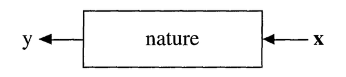
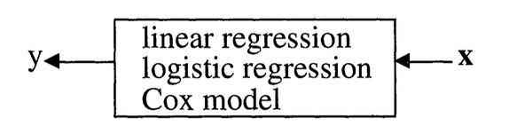
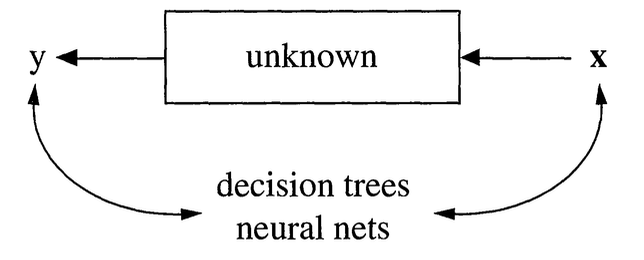
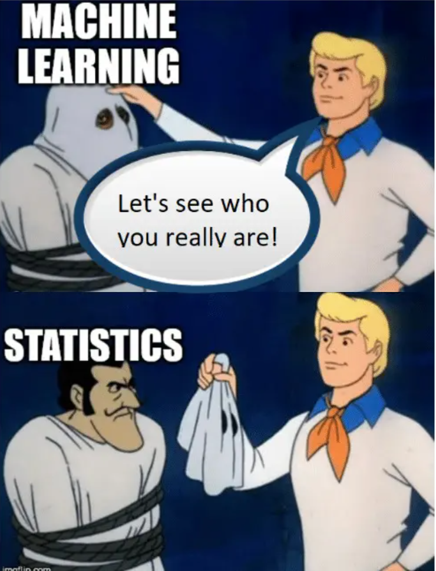
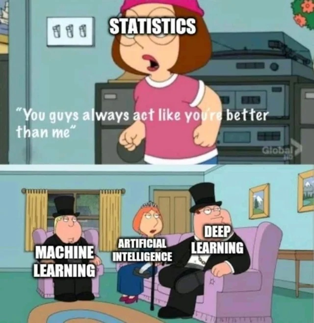

# The Two Cultures of Statistical Modeling

## Introduction

This lecture is based on the influential paper by Leo Breiman, "Statistical Modeling: The Two Cultures", published in Statistical Science in 2001.

This is a very good read and I highly recommend it to everyone interested in statistics and machine learning.

## Introduction

In statistics, we think as the data as being generated by "nature" with an unkown mechanism, which we can think of as a "black box".



## Introduction

There are two main goals in statistical modeling:

1. **Prediction**: to predict what the response variable will be for new observations.

2. **Information**: to extract some information about how nature is using the input variables to generate the response.

## Two Cultures

There are two different approaches to achieve these goals:

1. **The data modeling culture**: the "statistics approach".

2. **The algorithmic modeling culture**: the "machine learning approach".

## The Data Modeling Culture

We start by assuming a _stochastic_ model for the data generating process, i.e., for the inside of the black box.

For instance, we assume that data are generated as independent draws of
$$
y = f(X, \theta, \text{noise}),
$$

where $f$ is a known function, $\theta$ are unknown parameters, and the the parameters are estimated from the data (and the model).

## The Data Modeling Culture

For instance, with the linear model we assume
$$
y = X \beta + \varepsilon.
$$




## The Algorithmic Modeling Culture

In this approach, we consider the black box unknown and too complex to be described by a simple stochastic model.

Instead, we look for a function $f(x)$, seen only as an algorithm to _predict the response from the input variables_, without any assumption on the data generating process.

## The Algorithmic Modeling Culture



## Prediction vs. Explanation

Typically, in the data modeling culture, we evaluate the model by looking at the _goodness of fit_.

We focus on parameter estimates, and we care deeply about interpreting the values of the parameters and _explaining_ the model in the context of the application.

## Prediction vs. Explanation

On the other hand, in the algorithmic modeling culture, we evaluate the model by looking at _how well it can predict new, unseen observations_.

We do not care much about the interpretation of the parameters of the model, but just about how well it works in predicting the response.

. . .

Note that the same model can be seen through the lense of data modeling or algorithmic modeling.

## Example: Linear Regression

```{r}
#| echo: true
set.seed(1852)
diabetes <- read.table("data/diabetes.txt", header=TRUE)
trainidx <- sample(nrow(diabetes), 300)
testidx <- setdiff(seq_len(nrow(diabetes)), trainidx)
train <- diabetes[trainidx,]
test <- diabetes[testidx,]
```

## Linear Regression

```{r}
#| echo: true
fit <- lm(Y~., data=train)
summary(fit)
```

## Linear Regression

```{r}
plot(fit, which=1)
```


## Evaluating model performance

The most obvious way to see how well the model emulates nature is how close the values _predicted_ by the model are to the observed response.

. . .

At first, one might think that the closest the model fits to the data, the better.

. . .

But if the model has too many parameters it may _overfit_ the data and lead to poor performance on new data.

. . .

Measuring the performance on data unseen by the model is an effective way to protect against this effect.

## Linear Regression: evaluation

```{r}
#| echo: true

# predictions on test set
yhat <- predict(fit, newdata = test)

# mean squared error
sum((test$Y - yhat)^2)
```

# Principles

## The multiplicity of good models

Especially in high-dimensional settings, the data could point to several possible models and it is difficult to say which one most accurately reflects the data.

. . .

Breiman calls this the _Rashomon effect_, in which different models lead to almost identical performance, but to very different interpretations.

. . .

This may be an effect of instability, in which two models are close in terms of error but very distant in terms of its form.

## Example: variable selection in regression

```{r}
#| echo: true
model1 <- step(fit, direction = "backward", scope = formula(~ .), trace =FALSE)
summary(model1)
```

## Example: variable selection in regression

```{r}
#| echo: true
library(leaps)
models <- regsubsets(Y~., data = train, method = "seqrep", nvmax = 5)
model2 <- lm(Y~SEX+BMI+BP+S3+S5, data=train)
summary(model2)
```

## Example: variable selection in regression

```{r}
#| echo: true
# predictions on test set
yhat1 <- predict(model1, newdata = test)
yhat2 <- predict(model2, newdata = test)

# mean squared error
sum((test$Y - yhat1)^2)
sum((test$Y - yhat2)^2)
```

## Simplicity vs. accuracy

Occam's Razor is a principle that is often invoked in science and that usually is intended to mean "the simpler the better".

. . .

Unfortunately, in prediction, accuracy and simplicity (interpretability) are in conflict.

. . .

For instance, linear regression is a fairly interpretable model, but its accuracy is usually less than that of a neural network or a random 
forest.

## Simplicity vs. accuracy

This is a trade-off that needs to be taken into account.

. . .

The relative importance of simplicity and accuracy depends on the analytical goals and on the application.

## Information from a black box

Very often, deep neural networks and complex random forests are seen as black boxes, but _some_ information is available for these models too.

. . .

For instance, _variable importance_, in which by perturbing the values of a variable we can measure its importance on the prediction performance.

# Conclusions

## Statistics vs. Machine Learning?

Leo Breiman was very vocal on its support for machine learning as opposed to data modeling approaches.

. . .

However, things are not as clear cut, and a synthesis of these approaches is needed for modern data analysis.

. . .

New technologies like LLMs and Foundation Models, require _data scientists_ to think harder about these questions in the context of complex data and models.

## The best of two worlds

Modern data science approaches borrow concepts from apparently very distant approaches, like black-box deep learning and Bayesian probabilistic modeling.

See for instance, Variational Autoencoders, that couple neural network architectures with Bayesian modeling.

## Conclusions

Breiman in 2001 framed the discussion as the war between two cultures:

- **Statistical modeling** tries to understand the world
- **Algorithmic modeling** tries to predict the world

## Conclusions

In the world of AI the two cultures are converging into one but core tensions remain:

- Predictions vs Explanation
- Correlation vs Causation
- Performance vs Interpretability

## Conclusions



## Conclusions

Modern AI has taught us that **prediction can work without understanding**:

- The model doesn't understand the world!
- We don't understand the model!

## Conclusions




## Conclusions

However, _statistical thinking_ is important now more than ever in order to:

- Estimate the _uncertainty_ of the outputs
- _Evaluate_ how well the models work
- Infer _causal relations_ from associations
- Understand how _robust_ the results are to data perturbation 

## Conclusions


# Thank you for your attention!


